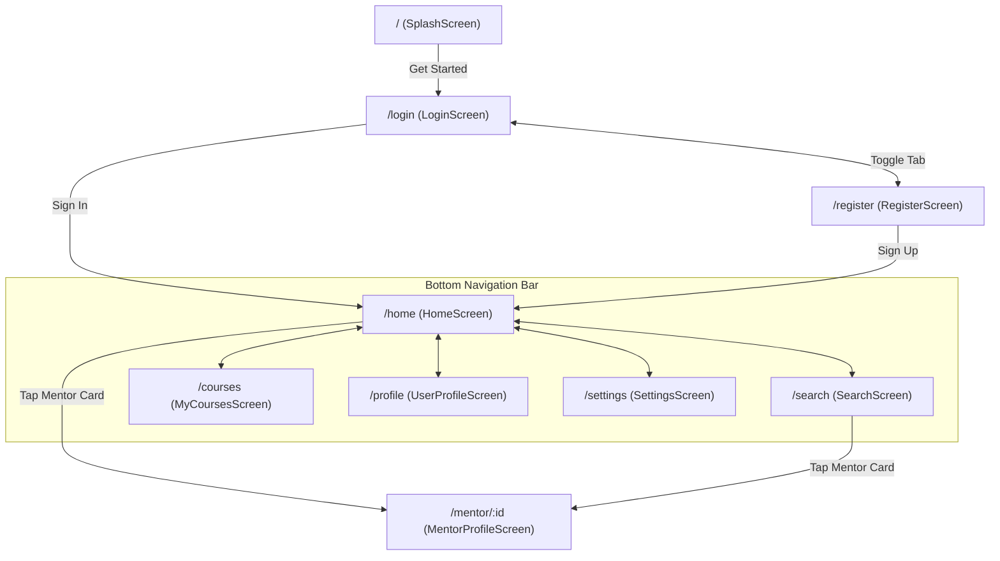

# 🎓 Jomnes — Mentor Booking & Learning App

[](https://flutter.dev)
[](https://dart.dev)
[](https://pub.dev/packages/go_router)
[](#features--screens)

**Jomnes** is a modern, high-performance Flutter mobile application designed to connect students with top-tier subject mentors, browse live & interactive courses, book 1-on-1 tutoring sessions, and track learning progress with a sleek, dark-themed user interface.

---

## 📑 Table of Contents
- [▶️ How to Run the Project](#️-how-to-run-the-project)
- [✨ Key Features & Implemented Screens](#-key-features--implemented-screens)
- [🛠️ Tech Stack & Dependencies](#️-tech-stack--dependencies)
- [📂 Project Directory Structure](#-project-directory-structure)
- [🎨 Design System & Visual Guidelines](#-design-system--visual-guidelines)
- [🚀 Getting Started & Local Development](#-getting-started--local-development)
- [🗺️ Routing & Navigation Matrix](#️-routing--navigation-matrix)
- [🔮 Supabase & Backend Roadmap](#-supabase--backend-roadmap)
- [📚 Additional Documentation](#-additional-documentation)

---

## ▶️ How to Run the Project

> **Prerequisites** — Make sure you have the following installed before running:
> - [Flutter SDK 3.12+](https://docs.flutter.dev/get-started/install)
> - [Dart SDK 3.0+](https://dart.dev/get-dart) *(bundled with Flutter)*
> - [Android Studio](https://developer.android.com/studio) *(for emulator or USB device)*
> - [Google Chrome](https://www.google.com/chrome/) *(for web)*
> - [Node.js 18+](https://nodejs.org/) *(for the backend server)*

### Step 1 — Install Flutter Dependencies

Run this once after cloning the project:

```bash
cd MOBILE_APPLICATION
flutter pub get
```

### Step 2 — Set Up Environment Variables

Copy the example `.env` file and fill in your Supabase credentials:

```bash
cp .env.example .env
```

Edit `.env` and set your values:

```env
SUPABASE_URL=https://your-project.supabase.co
SUPABASE_ANON_KEY=your-anon-key
```

### Step 3 — Start the Backend Server

The app requires the Node.js backend to be running for API calls:

```bash
cd backend
npm install       # only needed the first time
npm start         # starts the server on http://localhost:5005
```

Leave this terminal running, then open a new terminal for the Flutter commands below.

---

### 🌐 Run on Chrome (Web)

This is the fastest way to preview the app in a browser:

```bash
flutter run -d chrome
```

- Chrome will **open automatically** with the app running.
- The app URL will be a random `localhost` port (e.g. `http://localhost:54667`).
- Use **`r`** in the terminal for hot reload, **`R`** for hot restart.

To run on a **fixed port** (useful for sharing with teammates):

```bash
flutter run -d web-server --web-port 8080 --web-hostname localhost
```

Then open [http://localhost:8080](http://localhost:8080) manually in Chrome.

---

### 📱 Run on Android Studio (Emulator)

**Step 1** — Open Android Studio and create an emulator:
1. Go to **Device Manager** → **Create Device**
2. Choose a phone profile (e.g. *Pixel 6*) → Select a system image (API 33+)
3. Click **Finish**, then **▶ Launch** the emulator

**Step 2** — Verify Flutter can detect the emulator:

```bash
flutter devices
```

You should see your emulator listed (e.g. `sdk gphone64 x86 64 • emulator-5554`).

**Step 3** — Run the app on the emulator:

```bash
flutter run -d emulator-5554
```

Or simply run `flutter run` — if only one emulator is running, Flutter picks it automatically:

```bash
flutter run
```

---

### 📲 Run on a Physical Android Phone (USB)

**Step 1** — Enable Developer Mode on your phone:
1. Go to **Settings → About Phone**
2. Tap **Build Number** 7 times until you see *"You are now a developer"*
3. Go to **Settings → Developer Options** → Enable **USB Debugging**

**Step 2** — Connect your phone via USB cable, then verify Flutter detects it:

```bash
flutter devices
```

You should see your phone listed by model name.

**Step 3** — Run the app on your phone:

```bash
flutter run
```

If multiple devices are connected, specify the device ID:

```bash
flutter run -d <your-device-id>
```

Replace `<your-device-id>` with the ID shown by `flutter devices` (e.g. `R3CN90ABCDE`).

---

### 🛠️ Useful Flutter Commands

| Command | Description |
| :--- | :--- |
| `flutter devices` | List all connected devices & emulators |
| `flutter run` | Run on the default connected device |
| `flutter run -d chrome` | Run on Chrome browser |
| `flutter run -d emulator-5554` | Run on a specific emulator |
| `flutter pub get` | Install/update dependencies |
| `flutter clean` | Clear build cache (fixes most build errors) |
| `flutter build apk` | Build release APK for Android |
| `flutter analyze` | Run static code analysis |

---

## ✨ Key Features & Implemented Screens

| Screen | Route | Key Features & Implementation |
| :--- | :--- | :--- |
| **Splash / Onboarding** | `/` | Immersive hero illustration background, branded typography, animated entrance, and seamless onboarding flow. |
| **Authentication** | `/login`<br>`/register` | Dark aesthetic cards with animated tab switching, input validation, password toggle, social login buttons (Google, Facebook). |
| **Home Screen** | `/home` | Student profile banner with notification indicator, interactive search trigger, horizontal **Featured Courses** carousel (Math, Geography, Chemistry), and **Top Mentors** list with live availability badges. |
| **Search & Discovery** | `/search` | Dynamic category filter chips (All, Math, Science, Language, etc.), search bar with real-time mentor filtering, rating/experience highlights. |
| **Mentor Profile** | `/mentor/:id` | Detailed mentor header, rating/student/follower counters, subject badges, tabbed switcher (**About** vs. **Reviews**), and sticky **Book Session** CTA. |
| **My Courses** | `/courses` | Enrolled courses list, progress bars, lesson count indicators, live timer badges (`30 mins remaining`), and mentor info. |
| **User Profile** | `/profile` | Student dashboard (Jessica Carl), learning statistics (courses enrolled, hours learned, certificates earned), account management shortcuts. |
| **Settings Panel** | `/settings` | Account preferences, push notifications, dark/light appearance toggles, privacy & security options, help center, and logout dialog. |

---

## 🛠️ Tech Stack & Dependencies

| Category | Technology | Purpose |
| :--- | :--- | :--- |
| **Framework** | Flutter (SDK `^3.12.2`) | Cross-platform UI toolkit (iOS, Android, Web, Windows) |
| **Language** | Dart (SDK `^3.0.0`) | Object-oriented, client-optimized programming language |
| **Routing** | [`go_router: ^14.6.3`](https://pub.dev/packages/go_router) | Declarative navigation, deep linking, custom page transitions |
| **Typography** | [`google_fonts: ^6.2.1`](https://pub.dev/packages/google_fonts) | Inter font family integration |
| **Micro-Animations** | [`flutter_animate: ^4.5.0`](https://pub.dev/packages/flutter_animate) | Smooth staggered entrance transitions & micro-interactions |
| **Icons** | `cupertino_icons: ^1.0.8` & Material Icons | Pixel-crisp icon sets |

---

## 📂 Project Directory Structure

```text
MOBILE_APPLICATION/
├── assets/
│   └── images/                     # High-resolution course cards & mentor avatars
│       ├── featured_chemistry.png
│       ├── featured_geography.png
│       ├── featured_math.png
│       ├── hero_bg.png
│       ├── jessica_avatar.png
│       ├── jessica_large.png
│       ├── mentor_channara.png
│       └── mentor_thavy.png
├── docs/                           # Detailed Architecture & Backend Specs
│   ├── ARCHITECTURE.md             # Routing, widget hierarchy, design system tokens
│   ├── PROJECT_STATE.md            # Detailed status of all screens, widgets & features
│   └── BACKEND_INTEGRATION_PLAN.md # Supabase PostgreSQL Schema, RLS, & OAuth guide
├── lib/
│   ├── data/
│   │   └── mock_data.dart          # Static mock models for mentors, courses, and reviews
│   ├── models/
│   │   └── mentor.dart             # Mentor, Course, and FeaturedCourse data classes
│   ├── screens/
│   │   ├── home_screen.dart        # Main dashboard with featured courses & mentors
│   │   ├── login_screen.dart       # Sign-in screen with hero illustration
│   │   ├── mentor_profile_screen.dart # Detailed mentor profile & booking CTA
│   │   ├── my_courses_screen.dart  # Active learning & course progress tracker
│   │   ├── register_screen.dart    # Account creation screen
│   │   ├── search_screen.dart      # Mentor discovery & category filter screen
│   │   ├── settings_screen.dart    # Comprehensive app & account settings
│   │   ├── splash_screen.dart      # Brand splash screen
│   │   └── user_profile_screen.dart # Student profile & learning stats
│   ├── theme/
│   │   ├── app_colors.dart         # Design tokens & color constants
│   │   └── app_theme.dart          # ThemeData configuration & GoogleFonts Inter theme
│   ├── widgets/
│   │   ├── auth_widgets.dart       # Reusable auth text fields & social buttons
│   │   ├── bottom_nav_bar.dart     # Custom 5-tab persistent bottom navigation bar
│   │   ├── course_card.dart        # Horizontal & vertical course cards with progress
│   │   ├── featured_course_card.dart # Visual card with artwork & mentor name
│   │   ├── galaxy_background.dart  # Cosmic background decoration effect
│   │   ├── mentor_card.dart        # Mentor card with status, rating, and quick-book
│   │   └── tag_chip.dart           # Category and subject tag chips
│   ├── main.dart                   # Application entry point & SystemUI configuration
│   └── router.dart                 # Declarative GoRouter configuration & page transitions
└── pubspec.yaml                    # Flutter project configuration & asset declarations
```

---

## 🎨 Design System & Visual Guidelines

### Color Palette (`AppColors`)
* **Dark Background**: `#0A0A12` (`darkBg`), `#16161E` (`darkCard`), `#1C1C26` (`darkInput`)
* **Galaxy Accents**: `#7B3FC8` (Purple), `#3D1F8A` (Mid), `#1A0A4A` (Deep)
* **Course Card Tints**: `#E8B4FF` (Pink), `#B3E6FF` (Blue), `#E8820C` (Orange), `#0C7B8C` (Teal)
* **Brand Accents**: `#2563EB` (Accent Blue), `#EF4444` (Live Indicator Red)
* **Text Colors**: `#111827` (Text Primary), `#FFFFFF` (Text White), `#6B7280` (Text Secondary)

### Typography
* **Primary Font**: `GoogleFonts.inter`
* **Scale**:
  - Screen Titles: `24px - 28px`, Bold (`w700`)
  - Section Headers: `18px - 20px`, Semi-Bold (`w600`)
  - Body / Subtitles: `13px - 15px`, Regular (`w400`) / Medium (`w500`)
  - Badges & Micro-copy: `10px - 12px`, Medium (`w500`)

---

## 🚀 Getting Started & Local Development

See the [▶️ How to Run the Project](#️-how-to-run-the-project) section at the top for full setup and run instructions for Chrome, Android emulator, and physical devices.

### Quick Start Summary

```bash
# 1. Install dependencies
flutter pub get

# 2. Start backend (in a separate terminal)
cd backend && npm start

# 3. Run on Chrome
flutter run -d chrome

# 4. Run on Android emulator or phone
flutter run
```

---

## 🗺️ Routing & Navigation Matrix

All navigation transitions use custom slide + fade animations (`CurvedAnimation(curve: Curves.easeOutCubic)`):



---

## 🔮 Supabase & Backend Roadmap

The application is structured to easily transition from static mock data to **Supabase** backend services:

1. **Authentication**:
   - Native Google Sign-In via `google_sign_in` + `supabase.auth.signInWithIdToken`
   - Native Apple Sign-In via `sign_in_with_apple` + `supabase.auth.signInWithIdToken`
   - Email / Password with JWT session management
2. **PostgreSQL Relational Schema**:
   - `profiles` (Student metadata & statistics)
   - `mentors` (Bios, subjects, hourly rates, availability)
   - `courses` (Course details, duration, lessons, live status)
   - `bookings` (1-on-1 tutoring appointments & status tracking)
   - `reviews` (Student ratings and testimonials)
3. **Realtime & Storage**:
   - Instant booking status updates via Supabase Realtime Channels
   - Avatar & course asset uploads via Supabase Storage Buckets

---

## 📚 Additional Documentation
* [Architecture Deep Dive](docs/ARCHITECTURE.md)
* [Current Project State & Screen Audit](docs/PROJECT_STATE.md)
* [Supabase Backend & PostgreSQL Integration Plan](docs/BACKEND_INTEGRATION_PLAN.md)
