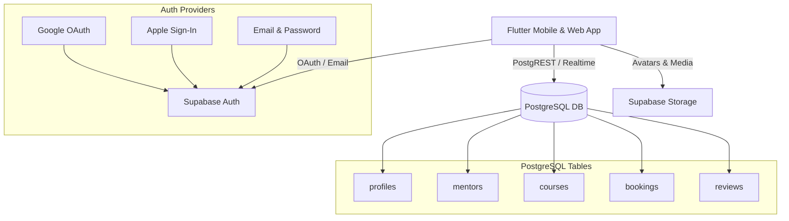

# 🔌 Jomnes — Supabase Backend & Database Integration Plan

## 1. Overview & Architecture

This document provides a comprehensive blueprint for integrating **Supabase** (PostgreSQL, Auth, Storage, and Realtime) into the **Jomnes** Flutter application.



---

## 2. PostgreSQL Relational Schema

Execute the following SQL script in your Supabase SQL Editor to initialize all tables, foreign keys, and Row-Level Security (RLS) policies:

```sql
-- Enable UUID extension
create extension if not exists "uuid-ossp";

-- 1. Profiles Table (Linked to Supabase Auth)
create table public.profiles (
  id uuid references auth.users on delete cascade primary key,
  full_name text not null,
  role text default 'student' check (role in ('student', 'mentor', 'admin')),
  avatar_url text,
  bio text,
  created_at timestamp with time zone default timezone('utc'::text, now()) not null,
  updated_at timestamp with time zone default timezone('utc'::text, now()) not null
);

-- Enable RLS for profiles
alter table public.profiles enable row level security;

create policy "Public profiles are viewable by everyone." 
  on public.profiles for select using (true);

create policy "Users can update their own profile." 
  on public.profiles for update using (auth.uid() = id);

-- 2. Mentors Table
create table public.mentors (
  id bigint generated always as identity primary key,
  user_id uuid references public.profiles(id) on delete set null,
  name text not null,
  subject text not null,
  experience text not null,
  time_slot text not null,
  avatar_url text not null,
  rating numeric(3, 2) default 5.0,
  students_count integer default 0,
  classes_count integer default 0,
  followers_count integer default 0,
  booking_price numeric(10, 2) not null,
  bio text not null,
  is_active boolean default true,
  created_at timestamp with time zone default timezone('utc'::text, now()) not null
);

alter table public.mentors enable row level security;
create policy "Anyone can view active mentors" 
  on public.mentors for select using (is_active = true);

-- 3. Courses Table
create table public.courses (
  id bigint generated always as identity primary key,
  mentor_id bigint references public.mentors(id) on delete cascade,
  title text not null,
  description text not null,
  rating numeric(3, 2) default 5.0,
  duration_hours integer not null,
  card_color text default 'pink' check (card_color in ('pink', 'blue', 'orange', 'teal', 'green')),
  is_live boolean default false,
  minutes_remaining integer,
  image_url text,
  is_featured boolean default false,
  created_at timestamp with time zone default timezone('utc'::text, now()) not null
);

alter table public.courses enable row level security;
create policy "Anyone can view courses" 
  on public.courses for select using (true);

-- 4. Enrollments / Course Progress Table
create table public.course_enrollments (
  id bigint generated always as identity primary key,
  user_id uuid references public.profiles(id) on delete cascade not null,
  course_id bigint references public.courses(id) on delete cascade not null,
  progress numeric(3, 2) default 0.0 check (progress >= 0.0 and progress <= 1.0),
  is_favorited boolean default false,
  enrolled_at timestamp with time zone default timezone('utc'::text, now()) not null,
  unique (user_id, course_id)
);

alter table public.course_enrollments enable row level security;
create policy "Users can view and edit their own enrollments" 
  on public.course_enrollments for all using (auth.uid() = user_id);

-- 5. Bookings Table
create table public.bookings (
  id bigint generated always as identity primary key,
  student_id uuid references public.profiles(id) on delete cascade not null,
  mentor_id bigint references public.mentors(id) on delete cascade not null,
  session_date date not null,
  time_slot text not null,
  amount_paid numeric(10, 2) not null,
  status text default 'confirmed' check (status in ('pending', 'confirmed', 'completed', 'cancelled')),
  created_at timestamp with time zone default timezone('utc'::text, now()) not null
);

alter table public.bookings enable row level security;
create policy "Users can view their own bookings" 
  on public.bookings for select using (auth.uid() = student_id);
create policy "Users can create bookings" 
  on public.bookings for insert with check (auth.uid() = student_id);

-- 6. Reviews Table
create table public.reviews (
  id bigint generated always as identity primary key,
  mentor_id bigint references public.mentors(id) on delete cascade not null,
  reviewer_id uuid references public.profiles(id) on delete set null not null,
  rating numeric(2, 1) not null check (rating >= 1.0 and rating <= 5.0),
  comment text not null,
  created_at timestamp with time zone default timezone('utc'::text, now()) not null
);

alter table public.reviews enable row level security;
create policy "Anyone can view reviews" 
  on public.reviews for select using (true);
create policy "Authenticated users can create reviews" 
  on public.reviews for insert with check (auth.uid() = reviewer_id);
```

---

## 3. Flutter Integration Steps

### Step 1: Add Dependencies to `pubspec.yaml`
```yaml
dependencies:
  flutter:
    sdk: flutter
  supabase_flutter: ^2.8.0
  google_sign_in: ^6.2.2
  sign_in_with_apple: ^6.1.4
```

### Step 2: Initialize Supabase in `lib/main.dart`
```dart
import 'package:flutter/material.dart';
import 'package:supabase_flutter/supabase_flutter.dart';
import 'router.dart';
import 'theme/app_theme.dart';

Future<void> main() async {
  WidgetsFlutterBinding.ensureInitialized();
  
  await Supabase.initialize(
    url: 'https://YOUR_PROJECT_ID.supabase.co',
    anonKey: 'YOUR_ANON_PUBLIC_KEY',
  );

  runApp(const JomnesApp());
}

final supabase = Supabase.instance.client;
```

---

## 4. Social Authentication Configuration

### 🟢 Google Sign-In Setup
1. Create OAuth 2.0 Client IDs in **Google Cloud Console**:
   - Web Client ID (used by Supabase)
   - Android Client ID (using SHA-1 fingerprint)
   - iOS Client ID (with URL Schemes)
2. Enter the Google Client ID & Client Secret in **Supabase Dashboard** -> **Authentication** -> **Providers** -> **Google**.
3. Flutter Dart implementation:
```dart
Future<void> signInWithGoogle() async {
  const webClientId = 'YOUR_WEB_CLIENT_ID.apps.googleusercontent.com';
  const iosClientId = 'YOUR_IOS_CLIENT_ID.apps.googleusercontent.com';

  final GoogleSignIn googleSignIn = GoogleSignIn(
    clientId: iosClientId,
    serverClientId: webClientId,
  );
  
  final googleUser = await googleSignIn.signIn();
  final googleAuth = await googleUser?.authentication;
  final idToken = googleAuth?.idToken;
  final accessToken = googleAuth?.accessToken;

  if (idToken == null) throw 'No ID Token found.';

  await supabase.auth.signInWithIdToken(
    provider: OAuthProvider.google,
    idToken: idToken,
    accessToken: accessToken,
  );
}
```

---

### 🍏 Apple Sign-In Setup
1. In **Apple Developer Portal**: Configure Services ID, Sign in with Apple Key (`.p8`), and Team ID.
2. Add credentials in **Supabase Dashboard** -> **Authentication** -> **Providers** -> **Apple**.
3. Flutter Dart implementation:
```dart
Future<void> signInWithApple() async {
  final rawNonce = supabase.auth.generateRawNonce();
  final hashedNonce = sha256.convert(utf8.encode(rawNonce)).toString();

  final credential = await SignInWithApple.getAppleIDCredential(
    scopes: [
      AppleIDAuthorizationScopes.email,
      AppleIDAuthorizationScopes.fullName,
    ],
    nonce: hashedNonce,
  );

  final idToken = credential.identityToken;
  if (idToken == null) throw 'No Identity Token received.';

  await supabase.auth.signInWithIdToken(
    provider: OAuthProvider.apple,
    idToken: idToken,
    nonce: rawNonce,
  );
}
```
